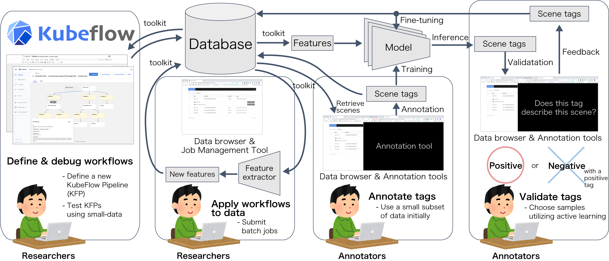

# dataware-tools

Dataware-tools are tools for researchers that enrich the value of data.

The goal of this project is to create tools for a framework to achieve the following things:
- Manage and handle variety format of data easily
- View and annotate data on web-browsers instantly
- Accelerate development of ML models / services by composing training and labeling into a looped pipeline

## Working groups
This project is maintained by the following working-groups.

| Group Name | Purpose |
| --- | --- |
| `wg-deployment` | Maintain manifest files and development / testing infrastructure |
| `wg-machine-learning` | Develop machine-learning related tools |
| `wg-web-app` | Develop web applications |

## Repositories
Part of repositories in this organization has a specific prefix as follows:
- `api-`: Backend APIs for web-applications
- `app-`: Frontend web-applications

Basically, web-applications in this organization depends on APIs separated into
multiple repositories.  
So most of the applications do not work standalone.  
Please read the section below to use the applications.

## How to use?
### Python toolkit
Please refer [dataware-tools/pydtk](https://github.com/dataware-tools/pydtk).

### Web-based applications
A demo of our web-app is available at [https://demo.dataware-tools.com/](https://demo.dataware-tools.com/).

If you want to deploy the application in you environment, 
please prepare a Kubernetes cluster and use the manifest files
maintained in [dataware-tools/manifests](https://github.com/dataware-tools/manifests).

## Where can I get more help?
Please contact [contact@hdwlab.co.jp](mailto:contact@hdwlab.co.jp).
