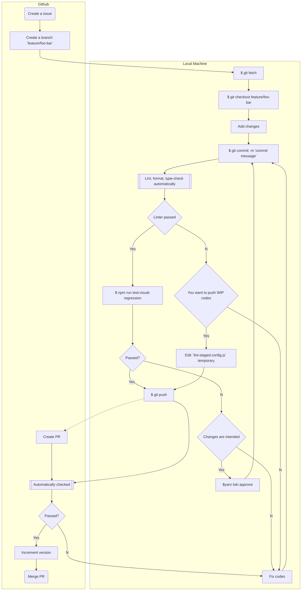

```mermaid
graph TB
    subgraph Github
    A(Create a issue) --> B[Create a branch `feature/foo-bar`]
    L[Create PR]
    L --> M[[Automatically checked]]
    M --> N{Passed?}
    N --Yes--> O[Increment version]
    O --> P(Merge PR)
    end
    subgraph Local Machine
    B --> C[$ git fetch]
    C --> D[$ git checkout feature/foo-bar]
    D --> E[Add changes]
    E --> F[$ git commit -m 'commit message']
    F --> F2[[Lint, format, type-check automatically]]
    F2 --> G{Linter passed}
    S--Yes--> H[$ git push]
    G --Yes--> Q[$ npm run test:visual-regression]
    Q --> S{Passed?}
    S --No--> R{Changes are intended}
    R --Yes--> T[$yarn loki approve]
    R --No--> K
    T --> F
    G --No--> I{You want to push WIP codes}
    I --Yes--> J[Edit `lint-staged.config.js` temporary]
    I --No--> K[Fix codes]
    K --> F
    J --> H
    H -.-> L
    H --> M
    end
    subgraph Github

    N --No--> K
    end
```
